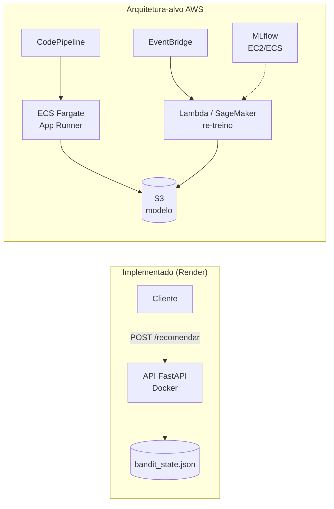

# Datathon - Grupo 43 - FIAP MLET

## Visão do Problema

Uma instituição financeira digital precisa decidir, em diferentes canais, qual
oferta apresentar para cada cliente elegível. Este projeto implementa uma
plataforma de experimentação adaptativa (multi-armed bandit) para essa decisão,
comparando-a contra uma abordagem de regra fixa (baseline).

**Abordagem escolhida:** Thompson Sampling, com os braços do bandit representando
três ofertas fictícias de produto:

- **Depósito Turbo** — produto padrão
- **Depósito Turbo+** — variação com incentivo
- **Consultoria Invest** — abordagem consultiva

**Base de dados:** [Bank Marketing (Kaggle)](https://www.kaggle.com/datasets/henriqueyamahata/bank-marketing)
— campanhas de telemarketing de um banco português, usada como proxy de
propensão à conversão.

> Nota sobre dados: nenhum dado real de cliente é utilizado. A base é pública
> e anonimizada, e as ofertas simuladas são construídas sobre ela apenas para
> fins de demonstração técnica.

## Como executar

### Pré-requisitos
- Python 3.10+

### Instalação
\`\`\`bash
git clone https://github.com/JonatasLocateli/datathon-8mlet-grupo-43.git
cd datathon-8mlet-grupo-43
python -m venv venv
source venv/bin/activate  # Windows: venv\Scripts\activate
pip install -r requirements.txt
\`\`\`

### Estrutura do projeto
\`\`\`
notebooks/   → EDA e experimentação (Etapas 1-4)
src/api/     → serviço FastAPI (Etapa 5)
src/bandit/  → implementação do Thompson Sampling
data/        → dados locais (não versionados - baixar via link acima)
\`\`\`

## Status do projeto

- [x] Etapa 0 — Organização do projeto
- [ ] Etapa 1 — Base Kaggle e EDA
- [ ] Etapa 2 — Preparação da Base
- [ ] Etapa 3 — Baseline e estratégia algorítmica
- [ ] Etapa 4 — Avaliação e Casos de Teste
- [ ] Etapa 5 — Serviço ou interface demonstrável
- [ ] Etapa 6 — Arquitetura-alvo em Nuvem
- [ ] Etapa 7 — Ciclo de vida MLOps
- [ ] Etapa 8 — Apresentação Final

## Base de Dados

**Fonte:** [Bank Marketing (Kaggle)](https://www.kaggle.com/datasets/henriqueyamahata/bank-marketing) — campanhas de telemarketing de um banco português (Moro et al., 2014).

**Volume original:** 41.188 registros × 21 colunas.

### Principais achados da EDA

- **Desbalanceamento do alvo:** apenas 11.3% dos clientes converteram (`y = yes`) — proporção relevante para o desenho do baseline e da simulação dos braços do bandit.
- **Valores "unknown":** presentes em 6 colunas categóricas. Mantidos como categoria própria (não removidos/imputados), pois representam parcela pequena na maioria dos casos (< 5%) — exceto `default` (20.87%), onde a análise mostrou que `unknown` converte a menos da metade da taxa de `default = no` (5.15% vs 12.88%), indicando que carrega sinal real e não é apenas ausência de dado.
- **`pdays` (dias desde o último contato):** 96.32% da base possui o valor-sentinela 999 (nunca contatado antes). Substituída por uma variável binária derivada, `contatado_antes`, por ser mais informativa que o valor numérico bruto.
- **`duration` (duração da ligação):** descartada por vazamento temporal — só é conhecida após a ligação ocorrer. Confirmado que ligações com conversão duram, em média, 2.5x mais (553s vs 221s) que ligações sem conversão, evidenciando o viés.
- **Idade x conversão:** relação não-linear (formato "U") — extremos etários convertem mais (jovens até 25 anos: 20.9%; idosos acima de 65 anos: 46.8%) enquanto a faixa 35-55 anos converte menos (~8.5-8.7%). Boa candidata a feature de contexto para o bandit.

**Tratamento aplicado:** colunas `duration` e `pdays` removidas do dataset de trabalho; coluna `contatado_antes` adicionada.

**Notebook:** `notebooks/eda.ipynb`

## Serviço de Recomendação (API)

A recomendação de oferta é servida via API REST construída com FastAPI, consumindo
o estado do bandit contextual treinado (persistido em `models/bandit_state.json`).

### Como executar

```bash
uvicorn src.api.main:app --reload
```

A API sobe em `http://127.0.0.1:8000`. Documentação interativa (Swagger) disponível em `http://127.0.0.1:8000/docs`.

### Endpoint

**POST** `/recomendar`

Requisição:
```json
{"idade": 68}
```

Resposta:
```json
{
  "segmento": "idoso",
  "oferta_recomendada": "Consultoria_Invest",
  "taxa_conversao_estimada": 0.2764
}
```
## Serviço de Recomendação (API)

A recomendação de oferta é servida via API REST construída com FastAPI, consumindo
o estado do bandit contextual treinado (persistido em `models/bandit_state.json`).
A API é containerizada (Dockerfile) e está publicada no Render.

**URL pública:** https://datathon-8mlet-grupo-43.onrender.com
**Documentação interativa (Swagger):** https://datathon-8mlet-grupo-43.onrender.com/docs

> Nota: o serviço roda em plano gratuito do Render, que "adormece" após período de
> inatividade — a primeira requisição após um período ocioso pode levar até ~60s.

### Como executar localmente

**Via Docker:**
```bash
docker build -t datathon-api .
docker run -p 8000:8000 datathon-api
```

**Ou diretamente com Uvicorn:**
```bash
uvicorn src.api.main:app --reload
```

### Endpoint

**POST** `/recomendar`

Requisição:
```json
{"idade": 68}
```

Resposta:
```json
{
  "segmento": "idoso",
  "oferta_recomendada": "Consultoria_Invest",
  "taxa_conversao_estimada": 0.2764
}
```
## Arquitetura-alvo em Nuvem

A API de recomendação já está implementada e publicada como um container Docker no
Render, validando a viabilidade da arquitetura em um ambiente real. Para um cenário
de produção em maior escala, os componentes equivalentes em AWS seriam: o container
FastAPI rodando em **ECS (Fargate)** ou **App Runner**, com deploy automatizado via
**CodePipeline** a partir do repositório Git; o artefato do modelo
(`bandit_state.json`) armazenado no **S3**, desacoplando o ciclo de vida do modelo
do deploy da aplicação; e o re-treinamento periódico do bandit orquestrado via
**EventBridge + Lambda** (ou um job no **SageMaker**, caso o pipeline de treino
cresça em complexidade), consumindo novos dados de conversão e publicando um
`bandit_state.json` atualizado no S3.

O rastreamento de experimentos (MLflow, Etapa 7) hoje roda localmente; em produção,
seria hospedado em uma instância dedicada (EC2 ou ECS) com backend de armazenamento
no S3, centralizando o histórico de execuções para toda a equipe.

