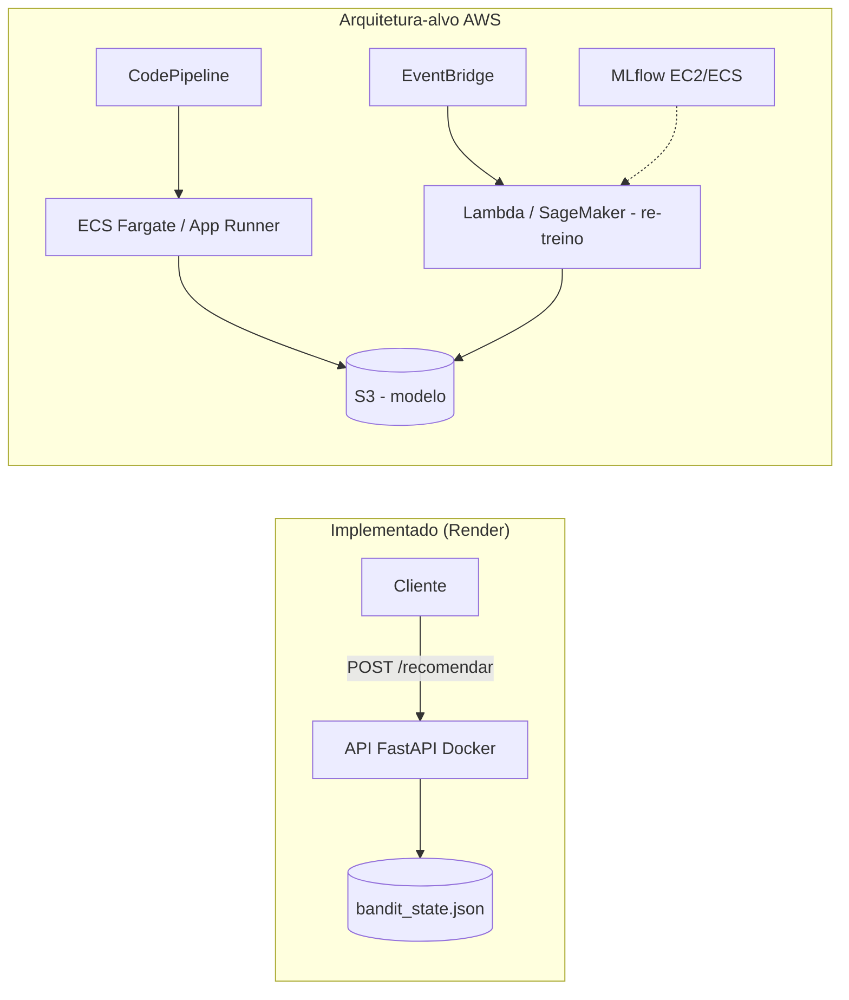

# Datathon - Grupo 43 - FIAP MLET


Plataforma de experimentação adaptativa para decisão de ofertas financeiras,
usando um bandit contextual (Thompson Sampling) para personalizar a recomendação
por perfil de cliente, comparada contra uma abordagem de regra fixa (baseline).

## Visão do Problema

Uma instituição financeira digital precisa decidir, em diferentes canais, qual
oferta apresentar para cada cliente elegível. Regras fixas e testes A/B tradicionais
desperdiçam tráfego e não personalizam por perfil. Este projeto demonstra uma
abordagem adaptativa completa — da formulação do problema ao deploy — usando a
base [Bank Marketing (Kaggle)](https://www.kaggle.com/datasets/henriqueyamahata/bank-marketing)
como referência factual.

**Abordagem:** Thompson Sampling contextual (segmentado por idade), com os braços
do bandit representando três ofertas fictícias de produto:

- **Depósito Turbo** — produto padrão
- **Depósito Turbo+** — variação com incentivo
- **Consultoria Invest** — abordagem consultiva

> Nota sobre dados: nenhum dado real de cliente é utilizado. A base é pública
> e anonimizada, e as ofertas simuladas são construídas sobre ela apenas para
> fins de demonstração técnica.

## Como executar

### Pré-requisitos

- Python 3.10+

### Instalação

```bash
git clone https://github.com/JonatasLocateli/datathon-8mlet-grupo-43.git
cd datathon-8mlet-grupo-43
python -m venv venv
source venv/bin/activate  # Windows: venv\Scripts\activate
pip install -r requirements.txt
```

### Estrutura do projeto

```
notebooks/     → EDA, modelagem, avaliacao e tracking de experimentos
src/api/       → servico FastAPI de recomendacao
models/        → artefato do bandit treinado (bandit_state.json)
Dockerfile     → containerizacao da API
data/          → dados locais (nao versionados - baixar via link acima)
```

## Base de Dados e Análise Exploratória

**Fonte:** [Bank Marketing (Kaggle)](https://www.kaggle.com/datasets/henriqueyamahata/bank-marketing) — campanhas de telemarketing de um banco português (Moro et al., 2014). 41.188 registros × 21 colunas.

### Principais achados

- **Desbalanceamento do alvo:** apenas 11.3% dos clientes converteram (`y = yes`).
- **Valores "unknown":** presentes em 6 colunas categóricas, mantidos como categoria própria. Em `default` (20.87% unknown), a taxa de conversão desse grupo é menos da metade da de `default = no` (5.15% vs 12.88%) — indicando que a ausência de informação carrega sinal real.
- **`pdays`:** 96.32% da base possui o valor-sentinela 999 (nunca contatado antes). Substituída por uma variável binária derivada, `contatado_antes`.
- **`duration`:** descartada por vazamento temporal — só é conhecida após a ligação ocorrer. Ligações com conversão duram, em média, 2.5x mais (553s vs 221s).
- **Idade x conversão:** relação não-linear (formato "U") — extremos etários convertem mais (jovens até 25 anos: 20.9%; idosos 65+: 46.8%) que a faixa 35-55 anos (~8.5-8.7%). Base para a definição dos braços do bandit.

**Notebook:** `notebooks/eda.ipynb`

## Simulação dos Braços do Bandit

Como a base não contém resposta a ofertas alternativas, a conversão por braço foi
simulada a partir de um modelo auxiliar de propensão (regressão logística), com
multiplicadores calculados diretamente da taxa de conversão real por faixa etária:

| Grupo | Multiplicador |
|---|---|
| Jovens (≤35) | 1.12x |
| Idosos (≥55) | 1.67x |
| Demais | 0.92x |

A diferenciação entre braços fica encoberta no agregado, mas é forte por segmento:
no segmento idoso, Consultoria Invest converte 27.64% contra 17.71% de Depósito
Turbo — evidência central para justificar a abordagem contextual.

## Baseline e Thompson Sampling

| Estratégia | Taxa de conversão |
|---|---|
| Baseline (regra fixa — melhor braço histórico) | 11.45% |
| Thompson Sampling não-contextual | 11.29% |
| **Thompson Sampling contextual** | **12.35%** (+0.91 p.p. sobre o baseline) |

O bandit não-contextual não superou o baseline, por não personalizar a decisão. A
versão contextual (segmentada por idade) convergiu, sem regra programada
explicitamente, para o mesmo padrão identificado na EDA:

| Segmento | Braço dominante | Frequência de escolha |
|---|---|---|
| Idoso | Consultoria Invest | 95.2% |
| Jovem | Depósito Turbo+ | 86.1% |
| Meia-idade | Depósito Turbo | 58.3% |

Os segmentos de idade definem apenas o contexto da decisão — não determinam qual
oferta é melhor. Cada segmento inicia com uma distribuição Beta(1,1), sem
conhecimento prévio, e o braço vencedor é aprendido unicamente a partir de
resultados observados de conversão. A convergência para menos de 100% em todos os
segmentos (ex: 95.2% no idoso, não 100%) reflete que o bandit mantém exploração
residual, preservando capacidade de adaptação caso o comportamento dos clientes
mude.

## Avaliação e Golden Set

Um conjunto de 5 clientes foi utilizado para validar a recomendação do bandit já
treinado:

| Cliente | Idade | Segmento | Recomendação | Observação |
|---|---|---|---|---|
| A | 22 | jovem | Depósito Turbo+ | Consistente com a EDA |
| B | 45 | meia-idade | Depósito Turbo | Segmento de menor diferenciação entre ofertas |
| C | 68 | idoso | Consultoria Invest | Consistente com o achado mais robusto da EDA |
| D | 35 | jovem | Depósito Turbo+ | Caso de fronteira (limite exato da regra de segmentação) |
| E | 75 | idoso | Consultoria Invest | Confirma robustez da recomendação |

**Limitação conhecida:** a segmentação por faixas fixas produz um efeito de
"degrau" nas fronteiras (Cliente D) — uma limitação de design, não um erro do
modelo.

## Serviço de Recomendação

A recomendação de oferta é servida via API REST construída com FastAPI, consumindo
o estado do bandit contextual treinado (persistido em `models/bandit_state.json`).
A API é containerizada (Dockerfile) e está publicada no Render.

**URL pública:** https://datathon-8mlet-grupo-43.onrender.com
**Documentação interativa (Swagger):** https://datathon-8mlet-grupo-43.onrender.com/docs

> Nota: o serviço roda em plano gratuito do Render, que "adormece" após período de
> inatividade — a primeira requisição após um período ocioso pode levar até ~60s.

### Como executar localmente

**Via Docker:**

```bash
docker build -t datathon-api .
docker run -p 8000:8000 datathon-api
```

**Ou diretamente com Uvicorn:**

```bash
uvicorn src.api.main:app --reload
```

### Endpoint

**POST** `/recomendar`

Requisição:

```json
{"idade": 68}
```

Resposta:

```json
{
  "segmento": "idoso",
  "oferta_recomendada": "Consultoria_Invest",
  "taxa_conversao_estimada": 0.2764
}
```

## Arquitetura-alvo em Nuvem

A API já está implementada e publicada como um container Docker no Render,
validando a viabilidade da arquitetura em um ambiente real. Para um cenário de
produção em maior escala, os componentes equivalentes em AWS seriam: o container
FastAPI rodando em **ECS (Fargate)** ou **App Runner**, com deploy automatizado via
**CodePipeline** a partir do repositório Git; o artefato do modelo
(`bandit_state.json`) armazenado no **S3**, desacoplando o ciclo de vida do modelo
do deploy da aplicação; e o re-treinamento periódico do bandit orquestrado via
**EventBridge + Lambda** (ou um job no **SageMaker**), consumindo novos dados de
conversão e publicando um `bandit_state.json` atualizado no S3.

O rastreamento de experimentos (MLflow) hoje roda localmente; em produção, seria
hospedado em uma instância dedicada (EC2 ou ECS) com backend de armazenamento no
S3, centralizando o histórico de execuções para toda a equipe.



## Ciclo de Vida MLOps (MLflow)

Os parâmetros do experimento (algoritmo, estratégia de segmentação, multiplicadores
calculados, seed) e as métricas de conversão (baseline, Thompson Sampling
não-contextual e contextual) são registrados via MLflow, junto com o artefato do
modelo treinado (`bandit_state.json`).

O histórico de execuções (`notebooks/mlruns/`) é versionado no próprio
repositório — não é necessário re-executar o notebook para visualizar os
resultados já registrados.

### Como visualizar

A partir da raiz do projeto:

```bash
mlflow ui --backend-store-uri ./notebooks/mlruns
```

Interface disponível em `http://127.0.0.1:5000` (aba "Model training"), listando
o experimento `datathon-bandit-recomendacao` com os parâmetros, métricas e o
artefato `bandit_state.json` de cada execução.

## Principais Decisões Técnicas

- **Braços simulados a partir de propensão real:** como a base não contém resposta
  a ofertas alternativas (problema do contrafactual), a conversão por braço foi
  simulada a partir de um modelo auxiliar de propensão, com multiplicadores
  calculados diretamente da taxa de conversão real por faixa etária — não
  arbitrários — para manter a simulação rastreável e defensável.
- **Baseline como "melhor braço histórico":** em vez de uma regra fixa arbitrária
  (ex: sempre a mesma oferta), o baseline foi definido como o braço de maior
  conversão agregada, por representar de forma mais realista a decisão de um
  banco tradicional baseada em dados de campanhas passadas.
- **Contexto limitado a uma dimensão (idade):** a segmentação do bandit usa
  apenas a faixa etária, o sinal mais forte identificado na EDA. Essa escolha
  também preserva volume suficiente de observações por segmento para uma
  convergência confiável do Thompson Sampling dentro da simulação — segmentar
  por múltiplas variáveis multiplicaria o número de grupos e reduziria as
  observações disponíveis em cada um. Ver "Possíveis Evoluções Futuras" para o
  caminho natural de expansão dessa limitação.
- **Persistência do estado do bandit separada da API:** o notebook realiza o
  treinamento e salva os parâmetros aprendidos (`alpha`/`beta` por braço e
  segmento) em `models/bandit_state.json`; a API apenas consome esse artefato,
  sem re-treinar a cada inicialização — separação entre treino e serviço,
  prática recomendada de MLOps.
- **Containerização e deploy real:** embora o enunciado exija apenas um parágrafo
  descrevendo a arquitetura-alvo em nuvem, a API foi de fato containerizada e
  publicada em produção no Render, validando a arquitetura descrita com uma
  implementação real.

## Possíveis Evoluções Futuras

- **Bandit linear contextual:** migrar da segmentação discreta por faixa etária
  para um bandit linear contextual, no qual cada braço estima a probabilidade de
  conversão a partir de todas as features disponíveis (idade, profissão,
  histórico de contato, indicadores macroeconômicos) sem a necessidade de
  particionar a base em grupos — permitindo incorporar mais contexto sem o custo
  de diluir as observações por segmento.
- **Re-treinamento automatizado:** orquestrar a atualização periódica do
  `bandit_state.json` a partir de novos dados de conversão, conforme descrito na
  arquitetura-alvo em nuvem (EventBridge + Lambda ou SageMaker).
- **Segmentação por múltiplas dimensões:** avaliar combinações de contexto (ex:
  idade × resultado de campanha anterior) com testes de significância
  estatística por segmento, garantindo volume mínimo de dados antes de
  fragmentar ainda mais os grupos.
- **MLflow centralizado:** mover o tracking de experimentos de um backend local
  em arquivo para uma instância dedicada com backend em banco de dados,
  possibilitando colaboração entre múltiplos membros do time.
